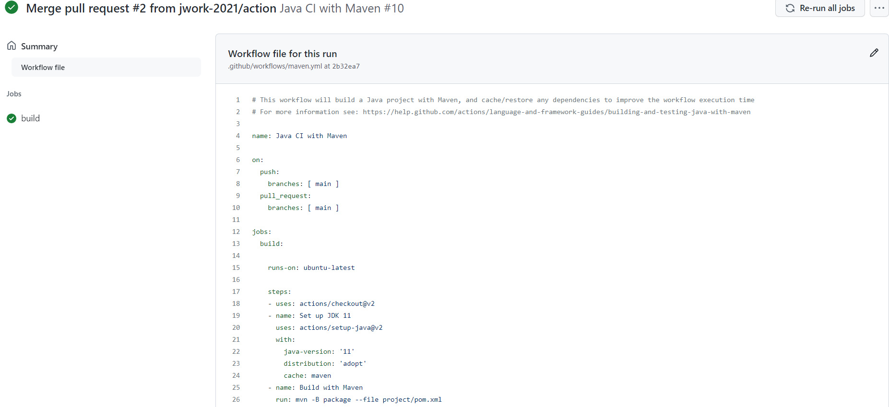
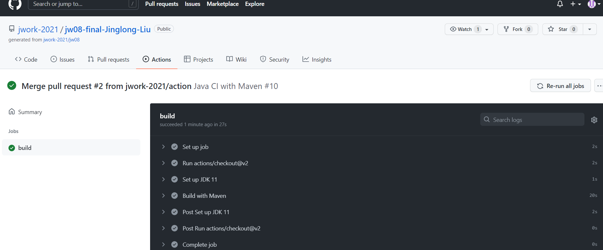
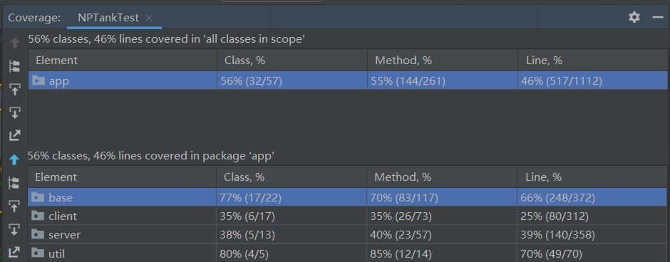

[](https://classroom.github.com/online_ide?assignment_repo_id=6470546&assignment_repo_type=AssignmentRepo)
# jw08

## 代码

请综合jw04-jw07所有要求，完成一个完整的图形化网络对战游戏。所有提交的作业将统一展出，由各位同学相互打分。


## 报告

在此基础之上，请以《Developing a Java Game from Scratch》为题撰写文章一篇，内容涵盖但不限于：
- 开发目标（我写的游戏是个什么样的游戏，灵感来源是什么）；
- 设计理念（代码总体设计是什么？这样设计的好处是什么？）；
- 技术问题（通信效率、并发控制、输入输出等问题我是怎么解决和优化的，面向对象设计方法带来了什么好处，等）；
- 工程问题（如何采用各种设计方法、工程方法来提高开发效率和代码质量）；
- 课程感言（对课程形式、内容等方面提出具体的意见和建议）
- 等

请使用《中国科学》的[latex模板](http://scis.scichina.com/download/ssi-template.zip)进行排版（不少于6页），输出pdf文件提交。

## 说明
- 已经完成代码和报告的编写。
- 项目用maven管理，主目录project。进入主目录执行 mvn package即可运行测试并打包jar。
或在根目录执行
``` 
 mvn -B package --file project/pom.xml
```
在github Action上用jdk11成功编译(在ubuntu-latest用jdk8需要更改配置中javafx版本，当然本地windows系统用jdk8是成功编译打包的)


- 报告在report目录中。
- 可执行jar包在target目录中，server.jar，client.jar表示服务器和客户端程序。
- 运行方式，游戏功能演示见 [B站视频](https://www.bilibili.com/video/BV1hY411p7mz?)，记得一键三连。
- 游戏视频覆盖了多人联机(jw07)、保存进度和地图(jw06)的要求。
- 已编写测试用例(jw06)，覆盖度大于50%。运行结果如下图。

